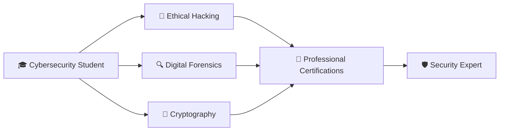

# <div align="center">

# 🛡️ Ali Al-Karrar (9gkc)


[](https://www.linkedin.com/in/9gkc)
[](https://github.com/9gkc)
[](https://github.com/9gkc)

</div>

---

## 👨‍💻 About Me

Welcome to my GitHub profile! I'm Ali Al-Karrar, a passionate Cybersecurity Student dedicated to exploring and securing the digital landscape. My journey involves diving deep into various aspects of cybersecurity, from ethical hacking to digital forensics, always striving to build a safer online world. 

```python
class CybersecurityStudent:
    def __init__(self):
        self.name = "Ali Al-Karrar"
        self.username = "9gkc"
        self.location = "Basra, Iraq 🇮🇶"
        self.university = "Al-Kunooze University"
        self.major = "Cybersecurity"
        self.interests = [
            "Digital Forensics",
            "Ethical Hacking",
            "Cryptography",
            "Network Security",
            "Malware Analysis"
        ]
        self.mission = "Building a safer digital world"
    
    def say_hi(self):
        print("Thanks for stopping by! Let's secure the digital world together 🔐")

me = CybersecurityStudent()
me.say_hi()
```

<div align="center">

### 🎯 Current Focus

🔍 Mastering **Advanced Penetration Testing**  
🛡️ Building **Security Automation Tools**  
📚 Studying **Malware Analysis & Reverse Engineering**  
🌐 Contributing to **Open Source Security Projects**

</div>

---

## 🛠️ Technical Arsenal

<div align="center">

### 💻 Programming Languages


### 🔒 Cybersecurity Tools


### 💾 Operating Systems


### 🛡️ Core Competencies

</div>

```text
🔐 Ethical Hacking          ████████████████████░   95%
🔍 Digital Forensics        ███████████████████░░   90%
🔑 Cryptography             ██████████████████░░░   85%
🌐 Network Security         ███████████████████░░   88%
🐍 Python Scripting         ████████████████████░   92%
⚙️  System Hardening        ██████████████████░░░   87%
```

---

## 📊 GitHub Statistics

<div align="center">


</div>

---

## 🏆 Achievements & Certifications

<div align="center">


</div>

---

## 🎓 Education & Learning Path


```mermaid
graph LR
    A[🎓 Cybersecurity Student] --> B[🔐 Ethical Hacking]
    A --> C[🔍 Digital Forensics]
    A --> D[🔑 Cryptography]
    B --> E[📜 Professional Certifications]
    C --> E
    D --> E
    E --> F[🛡️ Security Expert]
```

<div align="center">

### 📚 Currently Learning


</div>

---

## 💡 Specialization Areas

<table>
<tr>
<td width="50%">

### 🔍 Digital Forensics
- Evidence Collection & Preservation
- Memory & Disk Forensics
- Mobile Device Forensics
- Incident Response

</td>
<td width="50%">

### 🎯 Ethical Hacking
- Vulnerability Assessment
- Penetration Testing (Web/Network)
- Social Engineering
- Post-Exploitation Techniques

</td>
</tr>
<tr>
<td width="50%">

### 🔑 Cryptography
- Symmetric & Asymmetric Encryption
- Hash Functions & Digital Signatures
- PKI Infrastructure
- Secure Communication Protocols

</td>
<td width="50%">

### 🌐 Network Security
- Firewall Configuration
- IDS/IPS Implementation
- Network Traffic Analysis
- Secure Architecture Design

</td>
</tr>
</table>

---

## 🤝 Let's Connect

<div align="center">

📫 **Ready to collaborate on cybersecurity projects?**

[](https://www.linkedin.com/in/9gkc)
[](https://github.com/9gkc)
[](mailto:alkarara70cys@gmail.com)

</div>

---

<div align="center">

### 🔐 Security Thought

> *"Security is not a product, but a continuous process of improvement and vigilance."*  
> **— Ali Al-Karrar**

---


**Made with 💙 by Ali Al-Karrar | Last Updated: 2026**

</div>
