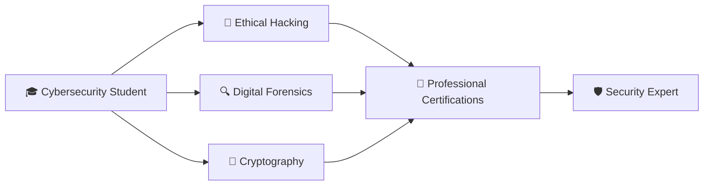

# <div align="center">

# 👋 Hello, I'm Ali Al-Karrar (9gkc)!


[](https://www.linkedin.com/in/9gkc)
[](https://github.com/9gkc)
[](mailto:alkarara70cys@gmail.com)
[](https://github.com/9gkc)

</div>

---

## 🚀 About Me

I'm Ali Al-Karrar, a passionate Cybersecurity Engineer and Web Developer from Basra, Iraq. My journey in the digital realm is driven by a relentless curiosity to understand, secure, and build innovative solutions. With a strong foundation in cybersecurity principles and hands-on experience in web development, I thrive at the intersection of creating robust applications and safeguarding them against evolving threats. My mission is to contribute to a safer and more functional digital world through continuous learning and practical application of knowledge. 🌐

```python
class AliAlKarrar:
    def __init__(self):
        self.name = "Ali Al-Karrar"
        self.title = "Cybersecurity Engineer | Web Developer"
        self.location = "Basra, Iraq 🇮🇶"
        self.focus = [
            "Advanced Penetration Testing",
            "Security Automation",
            "Malware Analysis & Reverse Engineering",
            "Full-Stack Web Development"
        ]
        self.passion = "Building secure and efficient digital experiences"

    def connect(self):
        print("Let's collaborate on impactful projects!")

me = AliAlKarrar()
me.connect()
```

---

## 🛠️ My Technical Stack

I leverage a diverse set of technologies to bring ideas to life and ensure their security.

<div align="center">

### 💻 Programming Languages & Web Technologies


### 🔒 Cybersecurity Tools & Platforms


### ☁️ Cloud & DevOps


</div>

---

## 🌟 Featured Projects

Here are some of my recent projects that showcase my skills:

*   ### [Bookmarks Manager Application](https://github.com/9gkc/bookmarks-manager-application)
    A simple yet effective **Bookmarks Manager Application** built with vanilla HTML, CSS, and JavaScript. It allows users to effortlessly save, categorize, and manage their favorite website links directly in their browser's local storage. 📚

*   ### [Tic Tac Toe Game](https://github.com/9gkc/tic-tac-toe-game)
    A classic **Tic Tac Toe game** built using vanilla HTML, CSS, and JavaScript. Challenge a friend or play against yourself in this timeless game of strategy. ✨

*   ### [Latest News Application](https://github.com/9gkc/latest-news-application)
    A simple **Latest News Application** built with vanilla HTML, CSS, and JavaScript. It fetches and displays the latest news headlines from around the world using the NewsAPI. 📰

*   ### [Password Generator With Options](https://github.com/9gkc/password-generator-with-options)
    A robust and user-friendly **Password Generator with Options** built using vanilla HTML, CSS, and JavaScript. It allows users to create strong, secure passwords tailored to their specific needs. 🔐

---

## 📊 GitHub Statistics

<div align="center">


</div>

---

## 🎓 Education & Learning Path

My academic background and continuous learning drive my expertise:


```mermaid
graph LR
    A[🎓 Cybersecurity Student] --> B[🔐 Ethical Hacking]
    A --> C[🔍 Digital Forensics]
    A --> D[🔑 Cryptography]
    B --> E[📜 Professional Certifications]
    C --> E
    D --> E
    E --> F[🛡️ Security Expert]
```

<div align="center">

### 📚 Currently Learning & Certifications


</div>

---

## 🤝 Let's Connect & Collaborate

I'm always open to new opportunities, collaborations, and discussions on cybersecurity and web development. Feel free to reach out!

<div align="center">

📫 **Ready to collaborate on impactful projects or discuss the latest in tech?**

[](https://www.linkedin.com/in/9gkc)
[](https://github.com/9gkc)
[](mailto:alkarara70cys@gmail.com)

</div>

---

<div align="center">

### 💡 Security Thought

> *"The only truly secure system is one that is powered off, cast in a block of concrete, and sealed in a lead-lined room with armed guards – and even then, I have my doubts."*  
> **— Gene Spafford**

---


**Made with 💙 by Ali Al-Karrar | Last Updated: 2026**

</div>
