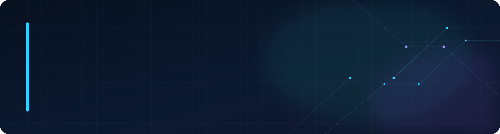

  

 

  <h1>9gkc</h1>
  
<strong>Secure software · Application security · Arabic-first learning</strong>

  
Build with clarity. Test with authorization. Ship useful software.

  <a href="https://github.com/9gkc"><strong>GitHub</strong></a>
  &nbsp;·&nbsp;
  <a href="https://linkedin.com/in/9gkc"><strong>LinkedIn</strong></a>
  &nbsp;·&nbsp;
  <a href="mailto:alkarara70cys@gmail.com"><strong>Contact</strong></a>

## About me

I am a **cybersecurity engineer and secure software builder** based in **Basra, Iraq**. I design practical tools and learning experiences at the intersection of **application security, full-stack development, and Arabic-first technical education**.

My work is guided by a simple standard: software should be useful, understandable, and safe to operate. That means clear scope, secure defaults, accessible interfaces, careful validation, and documentation that tells the truth about limitations.

> **Responsible-use boundary:** security research and testing are performed only with explicit authorization and within the approved scope.

### At a glance

| I care about | I build toward |
| :--- | :--- |
| **Application security** | Authorization checks, secure design reviews, low-impact assessments, and remediation-ready reports. |
| **Secure products** | Small, focused applications with predictable behavior, privacy-conscious storage, and accessible UX. |
| **Security education** | Arabic-first learning paths, safe lab guidance, and practical projects for the next generation of builders. |

## Projects

### Featured work

Four projects that best represent the direction of my work.

| 01 | **FileGuard** | A bilingual, offline-first Windows utility for inspecting selected local files without executing them or automatically uploading data. | [Release](https://github.com/9gkc/FileGuard/releases/latest) |
| :--- | :--- | :--- | :--- |
| 02 | **AuthZGuard** | Defensive authorization-verification tooling for explicit, approved API scopes, with CI-friendly reports and safeguards. | [Guide](https://9gkc.github.io/AuthZGuard/) |
| 03 | **IraqCode** | An Arabic-first bilingual programming platform with sequenced lessons, project missions, local progress, and a transparent skill passport. | [Live](https://9gkc.github.io/IraqCode/) |
| 04 | **AegisScope** | An allowlist-first AppSec workspace for authorized assets, findings, low-impact reviews, and structured reports. | [Platform](https://aegisappsec-apcnhon3.manus.space) |

### More work

**Security engineering** — [Cyber 4 Ever](https://github.com/9gkc/Cyber-4-Ever) · [Al-Kunooze-Security](https://github.com/9gkc/Al-Kunooze-Security) · [WiFiScan](https://github.com/9gkc/WiFiScan) · [AtomicSite](https://github.com/9gkc/AtomicSite)

**Learning and web applications** — [ShopFlow](https://github.com/9gkc/ShopFlow) · [Bookmarker](https://github.com/9gkc/Bookmarker) · [NewsFeed](https://github.com/9gkc/NewsFeed) · [CurrConv](https://github.com/9gkc/CurrConv) · [Eventify](https://github.com/9gkc/Eventify)

**Browser tools and interactive projects** — [PassGen](https://github.com/9gkc/PassGen) · [QuoteGen](https://github.com/9gkc/QuoteGen) · [Roshambo](https://github.com/9gkc/Roshambo) · [SlideShow](https://github.com/9gkc/SlideShow) · [TicTacToe](https://github.com/9gkc/TicTacToe)

## Technical skills

`JavaScript` · `TypeScript` · `Python` · `Dart` · `Java` · `React` · `Node.js` · `Express` · `Firebase` · `Flutter` · `Tailwind CSS` · `Git` · `GitHub Actions` · `Docker`

| Practice | Tools |
| :--- | :--- |
| **Security** | Burp Suite · Kali Linux · Wireshark · Metasploit · OWASP ZAP |
| **Engineering** | React · Node.js · Express · Firebase · Flutter · Tailwind CSS |
| **Workflow** | Git · GitHub Actions · Postman · Docker · VS Code |

## How I collaborate

I am open to focused collaboration on **open-source security tooling, Arabic-first technical education, secure web applications, and responsible disclosure**. The best starting point is a concise issue in the relevant repository with the problem, expected outcome, and useful context.

For a security concern, please follow the reporting guidance in [SECURITY.md](./SECURITY.md) rather than posting sensitive details publicly.

## Connect

---

  Build with clarity. Test with authorization. Ship useful software.

