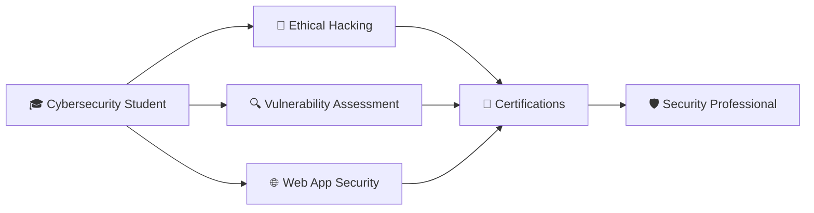

<div align="center">


<br/>


<a href="https://github.com/9gkc?tab=followers"></a>
<a href="https://github.com/9gkc?tab=repositories"></a>

</div>

<br/>

## 🚀 About Me

I'm **Ali Al-Karrar**, a Cybersecurity student and Web Developer from **Basra, Iraq 🇮🇶**. I focus on web application security, vulnerability assessment, and building secure, full-stack digital products — with hands-on experience in responsible disclosure research.

```python
class AliAlKarrar:
    def __init__(self):
        self.name = "Ali Al-Karrar"
        self.role = ["Cybersecurity Student", "Web Developer", "Security Researcher"]
        self.location = "Basra, Iraq 🇮🇶"
        self.focus = [
            "Web Application Security",
            "Vulnerability Assessment",
            "Responsible Disclosure",
            "Full-Stack Web Development (React, Firebase, Node.js, Flutter/Dart)"
        ]
        self.currently_learning = ["Advanced Penetration Testing", "Cloud Security"]

    def connect(self):
        return "Open to collaboration on security & dev projects 🤝"

ali = AliAlKarrar()
print(ali.connect())
```

<br/>

## 🛠️ Tech Stack

<div align="center">

**Languages & Frameworks**
<br/>


**Security & Tools**
<br/>


**Cloud & DevOps**
<br/>


</div>

<br/>

## 🌟 Featured Projects

<div align="center">

<a href="https://github.com/9gkc"></a>
<a href="https://github.com/9gkc"></a>
<a href="https://github.com/9gkc"></a>
<a href="https://github.com/9gkc"></a>

</div>

> 💡 **Note:** Replace the `repo=` values above with your actual repository names so the pinned cards render correctly.

<br/>

## 📊 GitHub Statistics

<div align="center">


</div>

### 🏆 Trophies

<div align="center">

</div>

### 📈 Contribution Activity

<div align="center">

</div>

### 🐍 Contribution Snake

<div align="center">

</div>

> ⚙️ To enable the snake animation, add the **[Platane/snk](https://github.com/Platane/snk)** GitHub Action to a repo named `9gkc/9gkc` — it auto-generates the SVG above on a schedule.

<br/>

## 🎓 Learning Path


```mermaid
graph LR
    A[🎓 Cybersecurity Student] --> B[🔐 Ethical Hacking]
    A --> C[🔍 Vulnerability Assessment]
    A --> D[🌐 Web App Security]
    B --> E[📜 Certifications]
    C --> E
    D --> E
    E --> F[🛡️ Security Professional]
```

<br/>

## 🤝 Connect With Me

<div align="center">

<a href="mailto:YOUR_EMAIL"></a>
<a href="https://linkedin.com/in/YOUR_LINKEDIN"></a>
<a href="https://twitter.com/YOUR_TWITTER"></a>
<a href="https://tryhackme.com/p/YOUR_PROFILE"></a>

</div>

> 💡 **Note:** Replace `YOUR_EMAIL`, `YOUR_LINKEDIN`, `YOUR_TWITTER`, and `YOUR_PROFILE` with your real links.

<br/>

<div align="center">

> "The only truly secure system is one that is powered off, cast in a block of concrete, and sealed in a lead-lined room with armed guards — and even then, I have my doubts."
> — **Gene Spafford**

<br/>


</div>
