<div align="center">

# 🛡️ Ali Al-Karrar (9gkc)


[](https://www.linkedin.com/in/9gkc)
[](https://github.com/9gkc)
[](https://github.com/9gkc)

</div>

---

## 👨‍💻 About Me

```python
class CybersecurityStudent:
    def __init__(self):
        self.name = "Ali Al-Karrar"
        self.username = "9gkc"
        self.location = "Basra, Iraq 🇮🇶"
        self.university = "Al-Kunooze University"
        self.major = "Cybersecurity"
        self.interests = [
            "Digital Forensics",
            "Ethical Hacking",
            "Cryptography",
            "Network Security",
            "Malware Analysis"
        ]
        self.mission = "Building a safer digital world"
    
    def say_hi(self):
        print("Thanks for stopping by! Let's secure the digital world together 🔐")

me = CybersecurityStudent()
me.say_hi()
```

<div align="center">

### 🎯 Current Focus

🔍 Mastering **Advanced Penetration Testing**  
🛡️ Building **Security Automation Tools**  
📚 Studying **Malware Analysis & Reverse Engineering**  
🌐 Contributing to **Open Source Security Projects**

</div>

---

## 🛠️ Technical Arsenal

<div align="center">

### 💻 Programming Languages


### 🔒 Cybersecurity Tools


### 💾 Operating Systems


### 🛡️ Core Competencies

</div>

```text
🔐 Ethical Hacking          ████████████████████░   95%
🔍 Digital Forensics        ███████████████████░░   90%
🔑 Cryptography             ██████████████████░░░   85%
🌐 Network Security         ███████████████████░░   88%
🐍 Python Scripting         ████████████████████░   92%
⚙️  System Hardening        ██████████████████░░░   87%
```

---

## 📊 GitHub Statistics

<div align="center">


</div>

---

## 🏆 Achievements & Certifications

<div align="center">


</div>

---

## 🎓 Education & Learning Path

```mermaid
graph LR
    A[🎓 Cybersecurity Student] --> B[🔐 Ethical Hacking]
    A --> C[🔍 Digital Forensics]
    A --> D[🔑 Cryptography]
    B --> E[📜 Professional Certifications]
    C --> E
    D --> E
    E --> F[🛡️ Security Expert]
```



<div align="center">

### 📚 Currently Learning


</div>

---

## 💡 Specialization Areas

<table>
<tr>
<td width="50%">

### 🔍 Digital Forensics
- Evidence Collection & Preservation
- Memory & Disk Forensics
- Mobile Device Forensics
- Incident Response

</td>
<td width="50%">

### 🎯 Ethical Hacking
- Vulnerability Assessment
- Penetration Testing (Web/Network)
- Social Engineering
- Post-Exploitation Techniques

</td>
</tr>
<tr>
<td width="50%">

### 🔑 Cryptography
- Symmetric & Asymmetric Encryption
- Hash Functions & Digital Signatures
- PKI Infrastructure
- Secure Communication Protocols

</td>
<td width="50%">

### 🌐 Network Security
- Firewall Configuration
- IDS/IPS Implementation
- Network Traffic Analysis
- Secure Architecture Design

</td>
</tr>
</table>

---

## 🤝 Let's Connect

<div align="center">

📫 **Ready to collaborate on cybersecurity projects?**

[](https://www.linkedin.com/in/9gkc)
[](https://github.com/9gkc)
[](mailto:alkarara70cys@gmail.com)

</div>

---

<div align="center">

### 💭 Quote of the Day


### 🔐 Security Thought

> *"Security is not a product, but a continuous process of improvement and vigilance."*  
> **— Ali Al-Karrar**

---


**Made with 💙 by Ali Al-Karrar | Last Updated: 2026**

</div>
